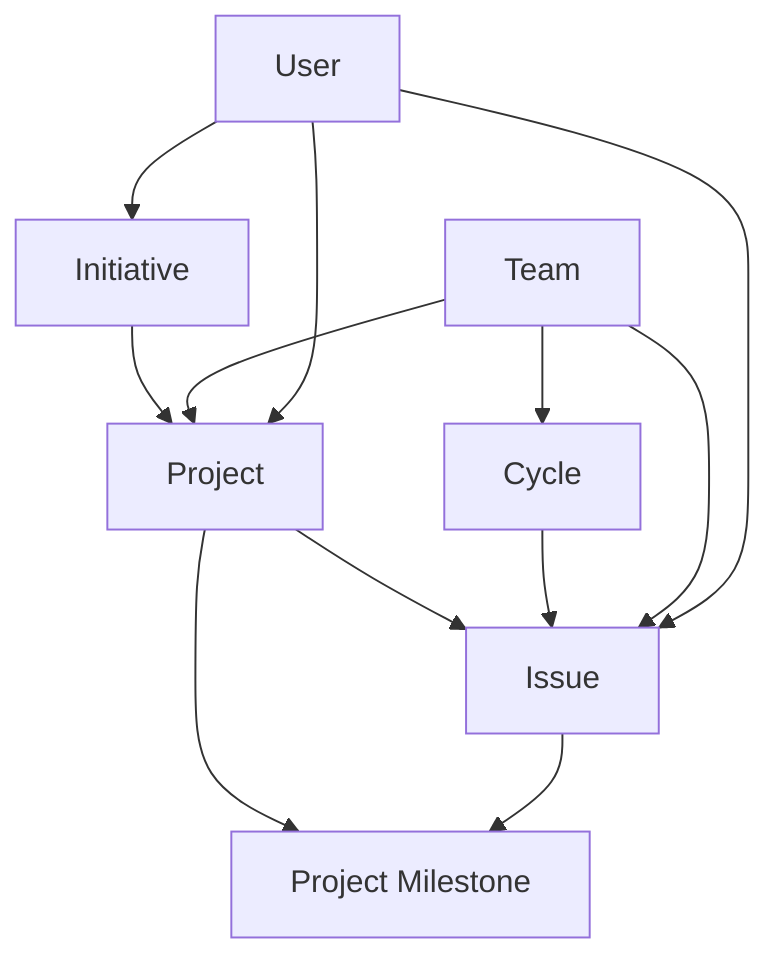

# Data Models & Schema Definitions

This document defines the data models and schema definitions for the Linear Helper MCP Server, mapping Linear's GraphQL schema to MCP tool interfaces.

## Core Entity Relationships



## Initiative Models

### InitiativeResult
Primary result type for initiative queries.

```typescript
interface InitiativeResult {
  id: string;                    // UUID
  name: string;                  // Initiative name
  description?: string;          // Optional description
  status: InitiativeStatus;      // Current status
  targetDate?: string;           // ISO date string
  progress: number;              // 0-100 percentage
  projectCount: number;          // Number of associated projects
  createdAt: string;             // ISO datetime
  updatedAt: string;             // ISO datetime
}

enum InitiativeStatus {
  PLANNED = 'planned',
  IN_PROGRESS = 'in_progress', 
  COMPLETED = 'completed',
  CANCELLED = 'cancelled'
}
```

### InitiativeDetails
Extended initiative information with relationships.

```typescript
interface InitiativeDetails extends InitiativeResult {
  projects: ProjectSummary[];              // Associated projects
  updates: InitiativeUpdate[];            // Progress updates
  relations: InitiativeRelation[];        // Related initiatives
  team?: TeamSummary;                     // Owning team
  lead?: UserSummary;                     // Initiative lead
}

interface InitiativeUpdate {
  id: string;
  body: string;                           // Update content
  createdAt: string;
  user: UserSummary;                      // Author
}

interface InitiativeRelation {
  id: string;
  type: 'blocks' | 'blocked_by' | 'related';
  initiative: InitiativeSummary;
}
```

## Cycle Models

### CycleResult
Primary result type for cycle queries.

```typescript
interface CycleResult {
  id: string;                    // UUID
  name: string;                  // Cycle name (e.g., "Cycle 15")
  number: number;                // Cycle number
  status: CycleStatus;           // Current status
  startsAt: string;              // ISO datetime
  endsAt: string;                // ISO datetime
  progress: number;              // 0-100 percentage
  issueCount: number;            // Total issues
  completedIssueCount: number;   // Completed issues
  team: TeamSummary;             // Owning team
}

enum CycleStatus {
  UPCOMING = 'upcoming',
  ACTIVE = 'active',
  COMPLETED = 'completed'
}
```

### CycleDetails
Extended cycle information with issues and analytics.

```typescript
interface CycleDetails extends CycleResult {
  issues: IssueSummary[];                    // All cycle issues
  uncompletedIssuesUponClose: IssueSummary[]; // Uncompleted issues
  description?: string;                       // Cycle description
  cooldownUntil?: string;                    // Cooldown period end
  velocity?: VelocityMetrics;                // Cycle velocity data
}

interface VelocityMetrics {
  plannedPoints: number;
  completedPoints: number;
  scopeChange: number;          // Points added/removed during cycle
}
```

## Project Milestone Models

### MilestoneResult
Primary result type for milestone queries.

```typescript
interface MilestoneResult {
  id: string;                    // UUID
  name: string;                  // Milestone name
  description?: string;          // Optional description
  status: MilestoneStatus;       // Current status
  targetDate?: string;           // ISO date string
  progress: number;              // 0-100 percentage
  issueCount: number;            // Total issues
  completedIssueCount: number;   // Completed issues
  sortOrder: number;             // Order within project
  project: ProjectSummary;       // Parent project
}

enum MilestoneStatus {
  PLANNED = 'planned',
  IN_PROGRESS = 'in_progress',
  COMPLETED = 'completed',
  CANCELLED = 'cancelled'
}
```

### MilestoneDetails
Extended milestone information with progress tracking.

```typescript
interface MilestoneDetails extends MilestoneResult {
  issues: IssueSummary[];                    // Associated issues
  progressHistory: ProgressHistoryEntry[];   // Progress over time
  dependencies: MilestoneDependency[];       // Milestone dependencies
  riskFactors: RiskFactor[];                 // Risk assessment
}

interface ProgressHistoryEntry {
  date: string;                  // ISO date
  progress: number;              // Progress percentage at date
  issueCount: number;            // Issue count at date
  completedCount: number;        // Completed issues at date
}

interface MilestoneDependency {
  id: string;
  type: 'blocks' | 'blocked_by';
  milestone: MilestoneSummary;
  project: ProjectSummary;
}
```

## Enhanced Project Models

### ProjectDetails
Extended project information with comprehensive data.

```typescript
interface ProjectDetails extends ProjectResult {
  milestones: MilestoneResult[];             // Project milestones
  initiatives: InitiativeSummary[];         // Parent initiatives
  teams: TeamSummary[];                     // Associated teams
  members: UserSummary[];                   // Project members
  documents: DocumentSummary[];             // Project documents
  updates: ProjectUpdate[];                 // Project updates
  metrics: ProjectMetrics;                  // Performance metrics
}

interface ProjectMetrics {
  velocityTrend: VelocityData[];            // Velocity over time
  burndownData: BurndownPoint[];            // Burndown chart data
  riskScore: number;                        // 0-100 risk assessment
  healthStatus: 'healthy' | 'at_risk' | 'critical';
}

interface VelocityData {
  period: string;                           // Time period
  planned: number;                          // Planned points
  completed: number;                        // Completed points
  efficiency: number;                       // Completion ratio
}

interface BurndownPoint {
  date: string;                             // ISO date
  remainingWork: number;                    // Remaining story points
  idealRemaining: number;                   // Ideal burndown line
}
```

## Summary Models

### Summary Types
Lightweight representations for relationships and listings.

```typescript
interface InitiativeSummary {
  id: string;
  name: string;
  status: InitiativeStatus;
  progress: number;
}

interface ProjectSummary {
  id: string;
  name: string;
  status: ProjectStatus;
  progress: number;
  targetDate?: string;
}

interface MilestoneSummary {
  id: string;
  name: string;
  status: MilestoneStatus;
  progress: number;
  targetDate?: string;
}

interface IssueSummary {
  id: string;
  title: string;
  status: IssueStatus;
  priority: IssuePriority;
  estimate?: number;
  assignee?: UserSummary;
}

interface TeamSummary {
  id: string;
  name: string;
  key: string;                              // Team key/prefix
  memberCount: number;
}

interface UserSummary {
  id: string;
  name: string;
  email: string;
  avatarUrl?: string;
}

interface DocumentSummary {
  id: string;
  title: string;
  updatedAt: string;
  creator: UserSummary;
}
```

## Filter Models

### Query Filters
Filter interfaces for advanced querying capabilities.

```typescript
interface InitiativeFilter {
  status?: InitiativeStatus[];
  teamIds?: string[];
  createdAfter?: string;
  createdBefore?: string;
  targetDateAfter?: string;
  targetDateBefore?: string;
  search?: string;
  hasOverdueProjects?: boolean;
}

interface CycleFilter {
  teamId: string;                           // Required
  status?: CycleStatus[];
  startsAfter?: string;
  startsBefore?: string;
  includeArchived?: boolean;
}

interface MilestoneFilter {
  projectId?: string;
  status?: MilestoneStatus[];
  targetDateAfter?: string;
  targetDateBefore?: string;
  overdue?: boolean;
  search?: string;
}

interface ProjectFilter {
  initiativeIds?: string[];
  teamIds?: string[];
  status?: ProjectStatus[];
  targetDateAfter?: string;
  targetDateBefore?: string;
  hasOverdueMilestones?: boolean;
  completionPercentageMin?: number;
  completionPercentageMax?: number;
}
```

## Analytics Models

### Metrics and KPIs
Data structures for analytics and reporting.

```typescript
interface TeamMetrics {
  teamId: string;
  period: MetricsPeriod;
  issueMetrics: IssueMetrics;
  cycleMetrics?: CycleMetrics;
  velocityTrend: VelocityData[];
  memberProductivity: MemberProductivity[];
  burndownData: BurndownPoint[];
}

interface IssueMetrics {
  created: number;                          // Issues created
  completed: number;                        // Issues completed
  averageCompletionTime: number;            // Hours to complete
  backlogSize: number;                      // Current backlog
  bugRatio: number;                         // Bug percentage
}

interface CycleMetrics {
  totalCycles: number;
  averageVelocity: number;
  velocityVariance: number;
  averageScope: number;
  scopeCreep: number;                       // Average scope change %
}

interface MemberProductivity {
  user: UserSummary;
  issuesCompleted: number;
  averageCompletionTime: number;
  velocityPoints: number;
  efficiency: number;                       // 0-1 efficiency score
}

enum MetricsPeriod {
  WEEK = 'week',
  MONTH = 'month', 
  QUARTER = 'quarter',
  YEAR = 'year'
}
```

## Search Models

### Search Results
Unified search result structures.

```typescript
interface SearchResult {
  entity: EntityType;
  id: string;
  title: string;
  description?: string;
  url: string;
  relevanceScore: number;                   // 0-1 relevance
  matchedFields: string[];                  // Fields that matched
  highlight?: string;                       // Highlighted snippet
  metadata: SearchMetadata;
}

enum EntityType {
  ISSUE = 'issue',
  PROJECT = 'project',
  INITIATIVE = 'initiative',
  MILESTONE = 'milestone',
  DOCUMENT = 'document',
  USER = 'user'
}

interface SearchMetadata {
  team?: TeamSummary;
  status?: string;
  createdAt: string;
  updatedAt: string;
  tags?: string[];
}
```

## Validation Schemas

### Zod Schemas
Runtime validation schemas for all models.

```typescript
import { z } from 'zod';

export const InitiativeResultSchema = z.object({
  id: z.string().uuid(),
  name: z.string().min(1).max(255),
  description: z.string().max(2000).optional(),
  status: z.enum(['planned', 'in_progress', 'completed', 'cancelled']),
  targetDate: z.string().datetime().optional(),
  progress: z.number().min(0).max(100),
  projectCount: z.number().min(0),
  createdAt: z.string().datetime(),
  updatedAt: z.string().datetime()
});

export const CreateInitiativeSchema = z.object({
  name: z.string().min(1).max(255),
  description: z.string().max(2000).optional(),
  targetDate: z.string().datetime().optional(),
  teamIds: z.array(z.string().uuid()).optional()
});

export const UpdateInitiativeSchema = z.object({
  id: z.string().uuid(),
  name: z.string().min(1).max(255).optional(),
  description: z.string().max(2000).optional(),
  status: z.enum(['planned', 'in_progress', 'completed', 'cancelled']).optional(),
  targetDate: z.string().datetime().optional()
});
```

## GraphQL Type Mapping

### Linear GraphQL to MCP Mapping
Transformation rules for GraphQL responses.

```typescript
// GraphQL Initiative -> MCP InitiativeResult
function mapInitiative(gql: GQLInitiative): InitiativeResult {
  return {
    id: gql.id,
    name: gql.name,
    description: gql.description || undefined,
    status: gql.status.toLowerCase() as InitiativeStatus,
    targetDate: gql.targetDate,
    progress: Math.round((gql.progress || 0) * 100),
    projectCount: gql.projects?.nodes?.length || 0,
    createdAt: gql.createdAt,
    updatedAt: gql.updatedAt
  };
}

// GraphQL Cycle -> MCP CycleResult  
function mapCycle(gql: GQLCycle): CycleResult {
  return {
    id: gql.id,
    name: gql.name,
    number: gql.number,
    status: mapCycleStatus(gql.endsAt, gql.startsAt),
    startsAt: gql.startsAt,
    endsAt: gql.endsAt,
    progress: Math.round((gql.progress || 0) * 100),
    issueCount: gql.issues?.nodes?.length || 0,
    completedIssueCount: gql.completedIssueCount || 0,
    team: mapTeamSummary(gql.team)
  };
}
```

## Error Models

### Error Handling Types
Standardized error responses for all operations.

```typescript
interface ToolError {
  code: ErrorCode;
  message: string;
  details?: Record<string, any>;
  timestamp: string;
  requestId?: string;
}

enum ErrorCode {
  INVALID_INPUT = 'INVALID_INPUT',
  NOT_FOUND = 'NOT_FOUND',
  UNAUTHORIZED = 'UNAUTHORIZED',
  FORBIDDEN = 'FORBIDDEN',
  RATE_LIMITED = 'RATE_LIMITED',
  INTERNAL_ERROR = 'INTERNAL_ERROR',
  VALIDATION_ERROR = 'VALIDATION_ERROR',
  CONFLICT = 'CONFLICT'
}

interface ValidationError extends ToolError {
  code: ErrorCode.VALIDATION_ERROR;
  fieldErrors: FieldError[];
}

interface FieldError {
  field: string;
  message: string;
  code: string;
}
```

## Last Updated
2025-06-14 by Danh Tran
